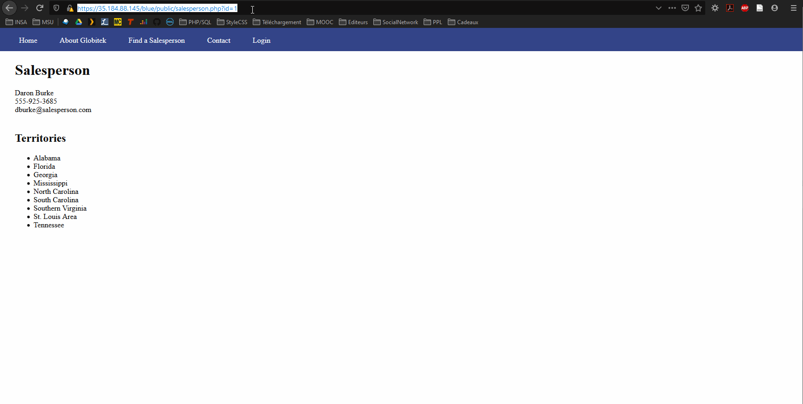
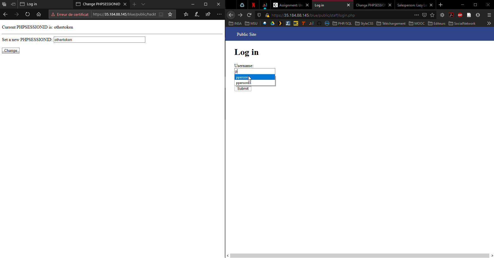
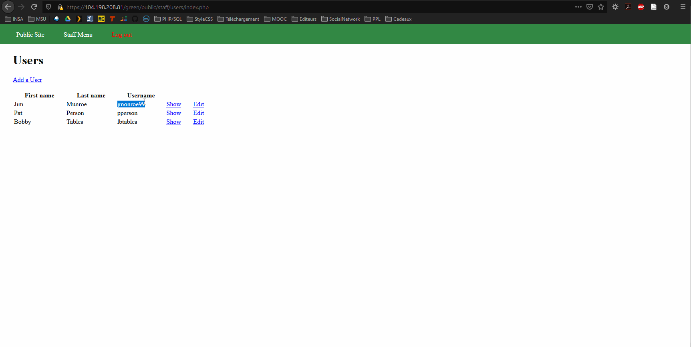
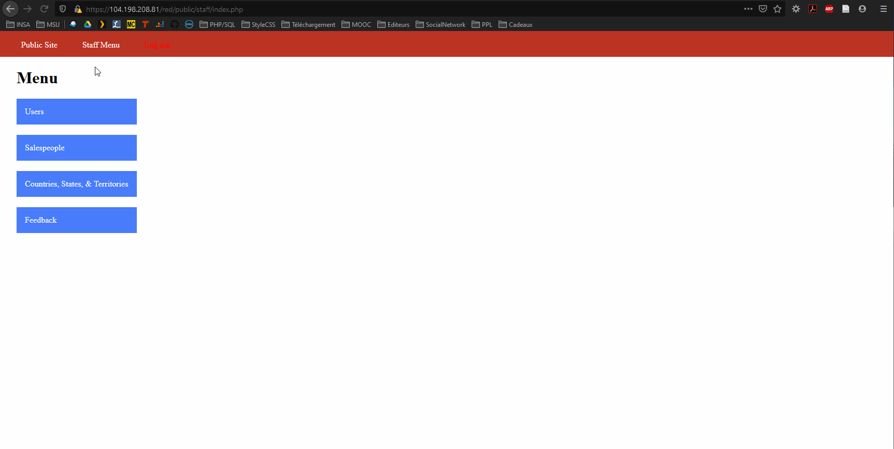

# Project 8 - Pentesting Live Targets

Time spent: **8** hours spent in total

> Objective: Identify vulnerabilities in three different versions of the Globitek website: blue, green, and red.

The six possible exploits are:
* Username Enumeration
* Insecure Direct Object Reference (IDOR)
* SQL Injection (SQLi)
* Cross-Site Scripting (XSS)
* Cross-Site Request Forgery (CSRF)
* Session Hijacking/Fixation

Each version of the site has been given two of the six vulnerabilities. (In other words, all six of the exploits should be assignable to one of the sites.)

## Blue

Vulnerability #1: SQLi
GIF Walkthrough: 
The id used to find a Salesperson is transmitted in a GET request, and it is not sanitized.

Vulnerability #2: Session Highjacking
GIF Walkthrough: 
I can connect to an admin account if I have his token. I can get this token through a Stored XSS for example (the sessionID is not in http-only here).

## Green

Vulnerability #1: Stored XSS
GIF Walkthrough: 
I can make a script which will be executed by an admin.

Vulnerability #2: Username Enumeration
GIF Walkthrough: 
When I type a valid username, "Log in was unsuccessful." is written in bold. And it isn't when I type an invalid username.

## Red

Vulnerability #1: IDOR
GIF Walkthrough: 
I can access to content which must be hidden. 

Vulnerability #2: __________________

## Concept Review
1. Which attacks were easiest to execute? Which were the most difficult?
	I think the easiest were the XSS, because it is the first one that y found and in like 10min. Then the most difficult were the CSRF, because I still haven't found it.

2. What is a good rule of thumb which would prevent accidentally username enumeration vulnerabilities like the one created here?
	Here we can see that the wrong login and the wrong password lead to different computation paths. The best way to avoid that is to create a simple boolean variable initiates at false and take the value true when the login match the password. By this way you have a successful or an unsucessful login and the wrong login and/or the wrong password follow the same computation path.

3. Since you should be somewhat familiar with the CMS and how it was coded, can you think of another resource which could be made vulnerable to an Insecure Direct Object Reference? What code could be removed which would expose it? (Hint: It was also the answer to the first bonus objective to the Weekly Assignment for week 3.)

4. Many SQL Injections use OR as part of the injected code. (For example: ' OR 1=1 --'.) Could AND work just as well in place of OR? (For example: ' AND 1=1 --'.) Why or why not?
	Of course AND could work. But we are using OR because AND suppose that the previous condition is true, so it's easy to use OR.

5. A stored XSS attack requires patience because it could be stored for months before being triggered. Because of this, what important ingredient would an attacker most likely include in a stored XSS attack script?
	The attacker could use of the social engineering to lead the victim to the XSS attack script.

6. Imagine that one of your classmates is an authorized admin for the site's CMS and you are not. How would you get them to visit the self-submitting, hidden form page you created in Objective #5 (CSRF)?
	I can invent a story to convince him to visit the Objective #5 page and make him send the hidden form (social engineering).

7. Compare session hijacking and session fixation. Which attack do you think is easier for an attacker to execute? Why? One of them is much easier to defend against than the other. Which one and why?
	I think the session hijacking is easier because I think that systems are less protected because you need the sessionID to get there. And I think the easier to defend is the session hijacking, because the session fixation, if you have access to the admin's computer, you can get the sessionID very quickly.

## Notes
Describe any challenges encountered while doing the work

